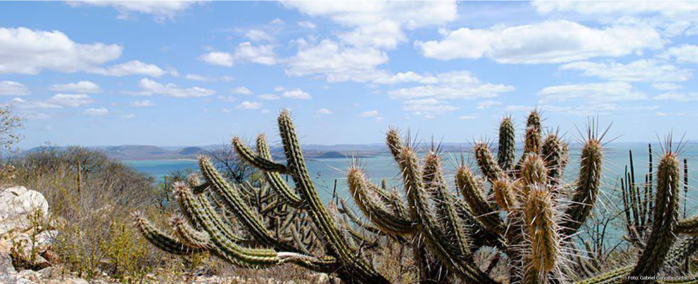
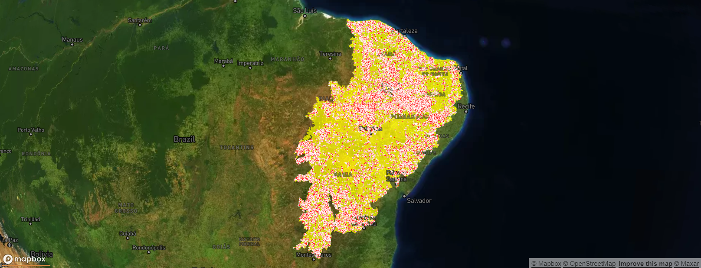
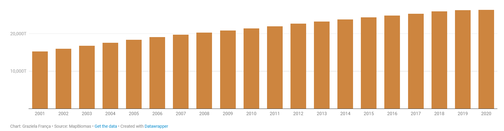
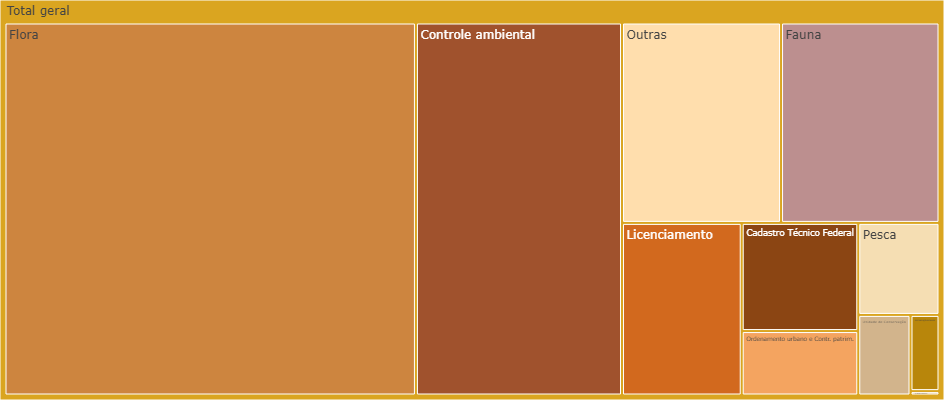

# 100% brasileiro, Caatinga sofre efeitos do desmatamento
Bioma já teve quase metade do seu território degradado

## Introdução do Trabalho Apresentado 

De acordo com dados coletados, de 1985 a 2022, a Caatinga perdeu em vegetação natural em torno de 6 milhões de hectares. Para se ter ideia da dimensão, a quantidade corresponde é como se uma Suíça e meia tivesse sido desmatada ao longo dos últimos 37 anos.

# Acumulado de desmatamento na Caatinga
Dados mostram redução da vegetação nativa de 2001 a 2020

# Multas ambientais ultrapassam R$19 milhões
Danos causados à Flora, Controle ambiental e outras causas estão entre os principais responsáveis pela crítica situação em que se encontra a Caatinga. Somente em 2022, as multas somaram mais de R$19 milhões, conforme divulgou, com dados obtidos via LAI, a Fiquem Sabendo. Nos dados também faltam muitas especificações dos tipos de biomas afetados e infrações registradas.

## 1. Criamos as Tela de HTML;

  
## 2. Criamos as Funções em JavaScript;

  
## 3. Criamos os arquivos de CSS;

## 4. Armazenamento dos dados;

##### Comando específico

  

